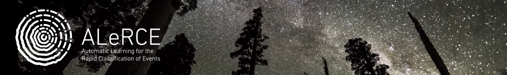

# ALeRCE notebooks

* [Interfaces Presentation](https://docs.google.com/presentation/d/1BU59JuaskiYxYr-wp1yVMdUb5aUtKjGystn2KB-bcuc/edit?usp=sharing)

* [Extragalactic Science](https://colab.research.google.com/github/broker-workshop/tutorials/blob/main/ALeRCE/ALeRCE_Extragalactic_notebook_brokers_workshop_2021.ipynb)

* [Galactic Science](https://colab.research.google.com/github/broker-workshop/tutorials/blob/main/ALeRCE/ALeRCE_Galactic_notebook_brokers_workshop_2021.ipynb)

* [Solar System Science](https://colab.research.google.com/github/broker-workshop/tutorials/blob/main/ALeRCE/ALeRCE_SolarSystem_notebook_brokers_workshop_2021.ipynb)

* [TOM/Marshall](https://colab.research.google.com/github/broker-workshop/tutorials/blob/main/ALeRCE/ALeRCE_Planner_notebook_brokers_workshop_2021.ipynb)

* [Training sets and validation](https://colab.research.google.com/github/broker-workshop/tutorials/blob/main/ALeRCE/ALeRCE_Training_sets_notebook_brokers_workshop_2021.ipynb)
