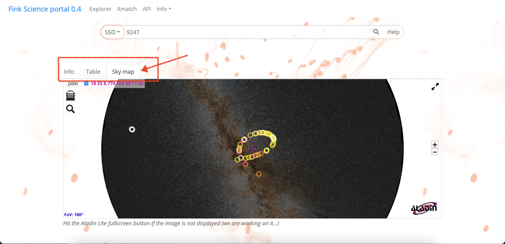

# Fink broker interfaces

We describe here all the ways to publicly access [Fink](https://fink-broker.org) data.

 <br />

## Livestreams

Fink distributes alerts via [Apache Kafka](https://kafka.apache.org/) topics based on one or several of the alert properties (label, classification, magnitude, ...). Topics are created via user-defined filters. You can connect to existing streams, or design your own filter to create a stream for your science need. We already have filters available for:

- Supernova science (SNe & early SN Ia)
- Kilonova science
- Solar System science
- Galactic science (variable stars)
- ...

You can connect to one or more of these topics using fink-client's APIs and receive Fink's stream of alerts. The client can easily be installed using pip:

```bash
pip install fink-client
```

Livestream alerts are received "live", that is after Fink ingestion and processing (typically a few minutes delay after ZTF emits the alert). Follow the [documentation](https://github.com/astrolabsoftware/fink-client/blob/master/docs/livestream_manual.md) to know more on this!

We suggest using livestreams for real-time follow-up coordination and analysis.

 <br />

## Science Portal / REST API

### Science Portal

#### Description

Fink proposes a web service to allow users to browse and display alert data collected and processed by Fink from a web browser. The Portal can be accessed from the [Fink website](https://fink-broker.org). 

We pushed ZTF public alert data from 01 November 2019 to now. This represents more than 70 million alerts collected (>3 TB), and about 30 million processed (>1 TB). Alerts are aggregated by their objectId, and all alerts contain original ZTF information and Fink added values.

Data is updated once a day, after the observing night is over. There is no plan to support streaming updates to HBase, and if you want live information we can provide live Kafka streams instead.

 <br />

#### Searching the database

After each observation night, the data is aggregated and pushed into Apache HBase tables (distributed, NoSQL). The main table contains all alert data processed by Fink since 2019-11-01, and it is indexed along the `objectId` of each alert, and the emission date `jd`.

In order to allow multi-indexing with HBase, we designed index tables. These tables are indexed along different properties (time, sky position, classification, ...). They contain the same number of rows than the main table but fewer columns. These index tables are used to perform fast search along arbitrary properties and isolate interesting candidates, while the main table is used to display final data.

Note that the next release will be based on Graph database to handle restlessly billion of alerts!

#### Available searches

Users can perform different types of search:

- **Search by Object ID:** Enter a valid object ID to access its data.
- **Conesearch:** Peform a conesearch around a position on the sky given by (RA, Dec, radius).
- **Search by Date:** Choose a starting date and a time window to see all alerts in this period. Dates are in UTC, and the time window in minutes.
- **Get latest 100 alerts by class:** Choose a class of interest using the dropdown menu to see the 100 latest alerts processed by Fink.
- **Solar System Object search:** Enter the number of a known Solar System object from the [Minor Planet Center (MPC)](https://minorplanetcenter.net/) to get its information by Fink.


<em>Figure 1: Fink search bar</em>   <br />  <br /> <br /> <br />

You will have then a table with your results, but also a skymap with all the query results!


<em>Figure 2: Table of results</em>  <br />  <br /> <br /> <br />


 
<em>Figure 3: Skymap</em> <br />  <br /> <br /> <br />


#### The power of the views!

The scientific interest of the Fink community is wide: supernovae, microlensing, multi-messenger astronomy, solar system objects... and it is difficult to give all information in one page for everyone. Hence, we developed views to explore particular aspects of each alert. By default, you will have a summary view of the object (cutouts, lightcurve, some textual information...). Then you can click on different tabs that will show different information based on a science topic: supernovae (e.g. classification score evolution), variable stars (fit using gatspy), microlensing (fit using pyLIMA), solar system object ...

 
<em>Figure 4: Summary view</em>  <br />  <br /> <br /> <br />


<em>Figure 5: Supernova view</em>  <br />  <br /> <br /> <br />


<em>Figure 6: Solar System Object view</em>  <br />  <br /> <br /> <br />

#### Feedback

This first version of the Portal contains only limited features, but it is extremely flexible. Things we would like to hear from you:

- Is it useful for your research?
- Are there things wrong? (classification, fit, ...)
- Are there things not working? (slowness, bugs, ...)
- What could be improved? (documentation, display, ...)
- What would you like to have? (new views, different information inside a view, ...)

We encourage users to send their feedback to the team (#scienceportal channel either in the Fink Slack workspace, in the [bug tracker](https://github.com/astrolabsoftware/fink-science-portal/issues), or by email to [contact@fink-broker.org](mailto:contact@fink-broker.org)). 


### REST API

The science portal is built on a REST API which is available to users as well. You can check the documentation at [http://134.158.75.151:24000/api](http://134.158.75.151:24000/api).

## TOM module

We also provide a [TOM](https://lco.global/tomtoolkit/) module for Fink. You can enable it in your TOM by simply installing it:

```bash
pip install tom-fink
```

As of version 0.2, the module simply uses the Fink REST API to retrieve alerts. Note that the Fink databases are updated once a day with the previous night alert data (hence you do not get live alerts for the moment). Users can perform:

- Search by ZTF object ID
- Cone Search
- Search by Date
- Search by derived alert class
- Search by Solar System name


<em>Figure 7: Fink button should appear in the list of broker</em> <br />  <br /> <br /> <br />


<em>Figure 8: Fink form contains all API features</em> <br />  <br /> <br />

More information at [https://github.com/TOMToolkit/tom_fink](https://github.com/TOMToolkit/tom_fink)
